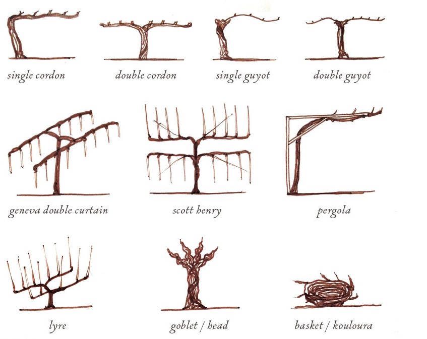

```{r setup, echo=FALSE, results='hide', message=FALSE, warning=FALSE}
# Če želimo nastaviti pisave v PDF-ju, odkomentiramo
# in sledimo navodilom v programu.
#source("fontconfig.r", encoding = "UTF-8")

# Uvoz vseh potrebnih knjižnic
source("lib/libraries.r", encoding = "UTF-8")
```

# Izbira teme

Za svojo projektno nalogo bom raziskal vinogradništvo v Sloveniji. Zanimalo me bo stanje slovenskih vinogradov ter katere sorte gojimo. Da bom bolje predstavil položaj slovenskega vinogradništva v svetu, bom poleg tega pogledal še število avtohtonih sort na državo.

  

# Obdelava, uvoz in čiščenje podatkov

```{r uvoz, echo=FALSE, message=FALSE, warning=FALSE}
source("uvoz/uvoz.r", encoding = "UTF-8")
```

Svoje raziskovanje sem začel z zunanjim izgledom vinogradov. Tu sem pridobil tri tabele, in sicer `stidy_gojenje`, `stidy_nagib`,`stidy_podlaga` ter `stidy_zatravljenost`, ki je v poročilo dodana kot primer tabele.  
Vse te tabele imajo podobno izgradnjo;  
- Prvi stolpec je stolpec `leto`  
- Drugi stolpec je stolpec `vinorodna.dezela`   
- Tretji stolpec je opisne spremenljivke, v podanem primeru je to `zatravljenost`   
- V nadaljnih stolpcih pa se nahajajo meritve:  
-  `povrsina`,  
-  `stevilo.sadik`  
-  `stevilo.vinogradov`.   
```{r, echo=FALSE, message=FALSE, warning=FALSE}
kable(head(stidy_zatravljenost))
```

  
Nadaljeval sem z dejanskim stanjem trt, in sicer so me zanimale sorte ter starost. Zato je tudi dobljena oblika tabele enaka kot v prvem delu, le da imamo v tretjem stolpcu v eni tabeli `Sorta`, v drugem pa `Starost`.  

  
Za nadaljno analizo pa so pomembne tudi dodatne tabele, iz katerih me bodo zanimali podatki o ekološki pridelavi v Sloveniji (`ekolosko`) ter o raznolikosti vinskih sort(`vse.sorte` ter `slovenske.sorte`).  
  

# Analiza in vizualizacija podatkov

```{r vizualizacija, echo=FALSE, message=FALSE, warning=FALSE}
source("vizualizacija/vizualizacija.r", encoding = "UTF-8")
```
```{r analiza, echo=FALSE, message=FALSE, warning=FALSE}
source("analiza/analiza.r", encoding = "UTF-8")
```
  
Preden si pogledamo stanje v slovenskih vinogradih, si poglejmo, kaj sploh pomeni slovensko vinogradništvo v Evropi in v svetu.  
```{r,echo=FALSE,message=FALSE}
print(zemljevid.drzave)
```
  
Vinogradništvo, ki je kot vidimo po svetu zelo razširjeno, je prav v Evropi najbogatejše. Slovenija v tem ni izjema, saj lahko vidimo, da je število avtohtonih sort podobno kot je v ostalih sosednjih državah z izjemo Italije, ki ima v sistemu [VIVC](www.vivc.de) vpisanih največ sort.  

```{r,echo=FALSE,message=FALSE, warning=FALSE}
print(zemljevid.evropa)
```
  
Slovensko vinogradništvo s 27 avtohtonimi sortami ne izstopa v svetovnem oziroma evropskem merilu, vendar je le to število manjše od povprečnega. Ker je torej avtohtonih sort malo lahko pričakujemo, da se bodo vsaj nekatere izmed teh sort pokazale med najpogostejšimi sortami.  
  
Analizo vinogradništva v Sloveniji sem začel z dejavniki, ki jih posameznik opazi takoj, ko stopi v vinograd, torej z nagnjenostjo površja, načinom gojenja, ter zatravljenostjo, temu pa sem dodal še analizo trtne podlage, saj gre za zelo pomemben dejavnik pri rasti trte.  
  
Pri tem se je izkazalo, da je največ vinogradov med 5% in 30% naklona, kar ni preveč veliko presenečenje, medtem ko me je osebno bolj presenetilo, da je kot način pridelave dvojni guyot bolj pogost kot enojni guyot.  

   
Glede na to, da je kakovost pridelave grozdja in posledično vina zelo odvisna od trtne podlage, me je zelo presenetil podatek, da za skoraj pol vseh sadik ni podatka, na kakšni podlagi rastejo. Tu je po mojem mnenju možnost za boljše rezultate slovenskega vinogradništva.  
Po tem sem se začel ukvarjati z drugim delom moje analize.Takoj na začetku sem si podal vprašanje, ali je med najpogostejšimi slovenskimi sortami res kakšna izmed tistih 27 slovenskih avtohtonih sort.Izkazalo se je, da sta med 24 najpogostejšimi sortami le dve sorti, ki sta v Sloveniji avtohtoni in sicer *Portugalka* in *Modra frankinja*. To kaže na vsaj delno zavednost slovenskih vinogradnikov o pomembnosti lokalnih sort.  
```{r,echo=FALSE,message=FALSE,warning=FALSE}
print(delez_sadik)
```

Ugotovil sem še, da je najpogostejša sorta v Sloveniji laški rizling, med rdečimi sortami pa prevladuje refošk. Pomembni beli sorti sta še chardonnay in sauvignon, ostale pa nastopajo v manjšem številu. Med rdečimi sortami so blizu refoška še modra frankinja, merlot in žametovka.  
 
Po tem sem pogledal trtno sestavo po starosti, in odkril težavo, ki bolj kot na vinogradnike vpliva na vinarje. V oči mi je padlo dejstvo, da je več kot 50% trt posajenih v slovenskih vinogradih starejših od 20 let. To so torej že starejše trte, ki lahko proizvedejo manj kakovostnega grozdja in posledično manj kakovostnega vina.  

```{r,echo=FALSE,message=FALSE,warning=FALSE}
print(sorte.slika.line)
```
  
Poleg tega sem pogledal, če je kakšna korelacija med površino ter številom sadik, posajenih na območju. Izkaže se, da je povezava lepa linearna funkcija, kar ni presenetljivo, saj se večina vinogradnikov drži tega, da pustijo med trtami vsaj meter prostora.  
  
Ko sem to dokončal, sem se odločil pogledati še podatke o ekološkem vinogradništvu v Sloveniji. 
```{r,echo=FALSE,message=FALSE,warning=FALSE}
print(eko_sprememba)
```
  
Kot povsod se tudi v slovenskem vinogradništvu kaže trend večjega nagiba k ekološkem kmetovanju. Precej hitreje narašča število vinogradov na ekoloških gospodarstvih kot število vinogradov na kmetijskih gospodarstvih v preusmeritvi. Za obe imed teh dveh gospodarstev sem se odločil pogledati kaj kaže trend do leta 2025, in tako poizkusiti določiti rast njihovega števila.  
  
>Za ekološki vinograd ne obstaja neke splošne definicije, prav tako se lahko ekološki vinogradi pri različnih vinarjih ter v različnih vinorodnih območjih precej razlikujejo.  Razlike so v sortah ter podlagah vinske trte, vzgojnih oblikah, obdelanosti tal, uporabi mehanizacije ter v uporabi pripravkov in gnojil dovoljenih v ekološki pridelavi. Skupni imenovalec vseh teh vinogradov pa je neuporaba sredstev za uničenje travne ruše, neuporaba lahkotopnih mineralnih gnojil, ter sintetičnih fungicidov in insekticidov. (Ekološko vinogradništvo, Dostopno na: http://www.ekolosko-vinogradnistvo.si/ekoloscaronki-vinograd.html, [23.1.2018])

```{r,echo=FALSE,message=FALSE,warning=FALSE}
grid.arrange(graf.napovedi.preu, graf_napoved.eko, ncol = 2)
```
  
Trend kaže, da bo do leta 2025 to število preseglo 55000, kar je nerealna številka, saj je bilo v Sloveniji leta 2009 42970 vinogradov, leta 2015 pa 49473, torej bi moralo število vinogradov na ekoloških kmetijah to številko povoziti.  
Medtem ko je pričakovano število vinogradov na kmetijskih gospodarstvih v preusmeritvi leta 2025 približno 33000, kar je še vedno pretirana številka.  

#Zaključek  
  
Iz zbranih podatkov lahko izvlečemo, da se je precej v porastu ekološko vinogradništvo, ostalih zaključkov pa iz zbranih podatkov ne moremo izvleči, saj je podatkov preprosto premalo.